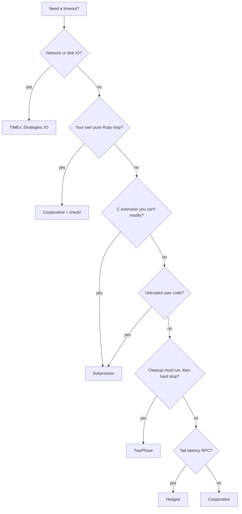

# Getting Started

[](https://rubygems.org/gems/timex)
[](https://github.com/drexed/timex/actions/workflows/ci.yml)
[](https://github.com/drexed/timex/blob/main/LICENSE.txt)

---

!!! note

    These docs follow `main`. If you are on an older gem version, open the `docs/` folder from that release’s tag so examples match what you run.

Welcome. **TIMEx** helps you answer a boring question with a calm voice: *“How
long am I willing to let this run?”* You describe a budget, run a block, and
the library keeps time using a **`Deadline`** you can pass around like cash.

If you have ever wrapped work in `Timeout.timeout` and crossed your fingers,
TIMEx is the “let’s be explicit instead” version.

**Sound familiar?**

- You need a timeout around a loop, but you do not want random exceptions
  ripping through mutexes.
- You inherited code that never calls `check!` and you cannot rewrite it today.
- You want nested calls to share one budget instead of starting ten unrelated
  timers.

**What you get on day one:**

- `TIMEx.deadline` / `TIMEx.call` as the front door—good defaults, obvious escape
  hatches.
- A **`Deadline`** in your block so cooperative code can `check!` at safe
  spots.
- A small ladder of stronger tools (auto-check, `TwoPhase`, subprocess) when
  cooperation is not possible.

## Requirements

- **Ruby:** MRI 3.3+ (or a recent JRuby / TruffleRuby that matches)

## Installation

Pick one:

```sh
gem install timex

# - or -

bundle add timex
```

## Configuration

Most apps start with defaults. When you want process-wide settings (default
strategy, telemetry, auto-check), use one `TIMEx.configure` block—full tour in
[Configuration](configuration.md).

## Quick Start

Below is the smallest happy path: two seconds of budget, a loop, and a
`check!` inside the loop so TIMEx can stop cooperatively.

```ruby
require "timex"

result = TIMEx.deadline(2.0) do |deadline|
  data = []
  100.times do
    deadline.check!
    data << expensive_step
  end
  data
end
```

What just happened?

- `TIMEx.deadline(seconds_or_deadline) { |deadline| ... }` picks the **default
  cooperative** strategy unless you override it.
- The block receives a **`Deadline`**. Call **`deadline.check!`** now and then
  so time actually gets enforced inside pure Ruby work.

Same thing, nicer name for code review:

```ruby
TIMEx.deadline(rpc.deadline_seconds) { rpc.call }
```

(`TIMEx.deadline` is simply an alias of `TIMEx.deadline`.)

## Real-world: bounded work inside a job

Say a Sidekiq job pulls up to 10_000 rows and calls an external scorer. You
want the whole job under five seconds and each row to notice the clock:

```ruby
TIMEx.deadline(5.0) do |deadline|
  rows.each do |row|
    deadline.check!
    scorer.score(row)
  end
end
```

Same pattern fits cron scripts, Rake tasks, and Puma request bodies—anywhere
you own the loop and can afford a `check!` per iteration.

## When the block cannot call `check!`

Sometimes you do not control the loop—legacy gem, tight C extension, user
plugin. You still have options; they get stronger as you go down the list:

1. **Auto-check** — TIMEx uses TracePoint to poll the deadline for you (opt-in,
   not free lunch):

   ```ruby
   TIMEx.deadline(2.0, auto_check: true) { legacy_loop }
   ```

   Details: [Auto-check](auto_check.md).

2. **TwoPhase** — cooperative first, then a hard backstop after a grace window
   (the block may run **twice** on escalation, so the work must be safe to repeat):

   ```ruby
   TIMEx::Composers::TwoPhase.new(
     soft: :cooperative, hard: :unsafe, grace: 0.5, hard_deadline: 1.0,
     idempotent: true
   ).call(deadline: 2.0) { legacy_loop }
   ```

   Details: [TwoPhase](composers/two_phase.md).

3. **Subprocess** — run the risky bit in a child process you can terminate:

   ```ruby
   TIMEx.deadline(2.0, strategy: :subprocess) { c_extension_call }
   ```

   Details: [Subprocess](strategies/subprocess.md).

## Pick a strategy (cheat sheet)

Follow the nodes honestly—if you lie to this chart, production will tattle on
you later.



## Reach for native timeouts first

!!! warning "TIMEx does not stop the IO — the client does"

    **Always set the library’s built-in timeout before wrapping the call in
    TIMEx.** Wrapping a `Net::HTTP` request in `TIMEx.deadline(2.0)` without also
    setting `read_timeout = 2.0` means the socket can keep blocking after the
    budget expires.

Native timeouts run *inside the client* — socket options, driver settings,
query cancels — and stop the *real* work. TIMEx caps how long *Ruby waits*
for that work to come back. The two solve different halves of the problem,
and you almost always want both.

The right mental model is layered:

1. Configure the client’s native timeout so the IO itself can fail fast.
2. Wrap the call in `TIMEx.deadline` to enforce a *whole-operation* budget across
   multiple hops, retries, or pure-Ruby work in between.
3. Pass `Deadline` down the stack so each hop shrinks the budget with
   `Deadline#min` instead of starting a fresh timer.

Common knobs to set first:

| Library | Use this first |
|---|---|
| `Net::HTTP` | `open_timeout=`, `read_timeout=`, `write_timeout=` |
| Faraday / HTTPX / HTTP.rb | `open_timeout`, `timeout`, `request :timeout` |
| `redis-rb` | `connect_timeout`, `read_timeout`, `write_timeout` |
| `pg` / `mysql2` | `connect_timeout`, `statement_timeout`, `read_timeout` |
| ActiveRecord | `connect_timeout`, `statement_timeout`, `lock_timeout` |
| AWS / Google SDKs | client-level `http_open_timeout`, `http_read_timeout` |
| Sidekiq / Rack | server `timeout` / `worker_timeout` settings |
| gRPC | per-call `deadline:` |

Reach for TIMEx when:

- You need *one* budget shared across multiple native-timeout calls.
- You own a pure-Ruby loop and can sprinkle `deadline.check!`.
- The code has *no* native timeout — legacy gems, C extensions, untrusted
  blocks. See [Subprocess](strategies/subprocess.md) and
  [TwoPhase](composers/two_phase.md).
